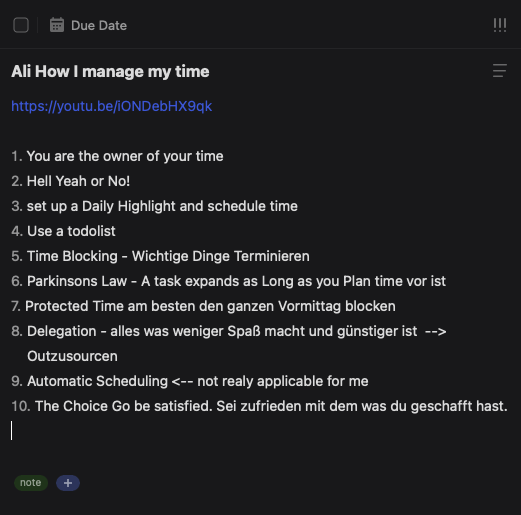
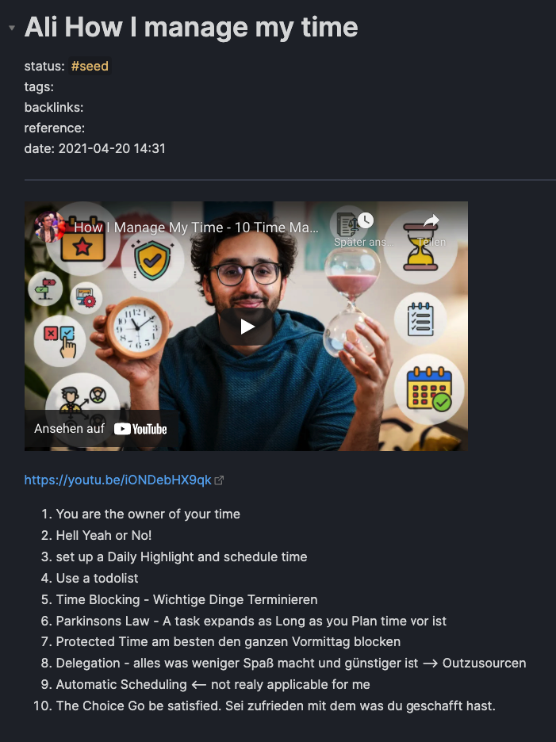

# TickTick to markdown
Download TickTick notes as markdown files for use with obsidian or other markdown editors

## Intention
As I was seetting up a second brain based on obsidian, I was always struggeling with notes which I
took on the go. Since I use Ticktick.com quite a while, the idea was to use this as an mobile entry point
for all the daily notes which I take. Since I dont want to copy the notes manually into obsidian, this script was born.

## Features
- reads tasks from TickTick.com and searchs for a specific tag (e.g. "note")
- creates a markdown file for each flaged task
- embeds YoutTube video into markdown file if YouTube link is provided in note description
- completes task after file creation

## Setup

1. clone repository and provide your `username` and `password` as well as the `path` where markdown
files shall be store in `config.py`
2. install requirements.txt with `pip install -r requirements.txt``

## Run script

Execute script with 
```python get_notes.py```

## My workflow

1. I create a task in my inbox and write down some notes when I´m on the go or on the iPad while watching youtube videos.
2. add `#note` tag to task
3. The script runs every hour on my Macbook. This is scheduled via cronjob and creates the notes in a obsidian folder INBOX so I can find new notes directly and process them further. Most of the time i just check if I would like to add something to it and move it to my folder "Second Brain"

## Screenshots
TickTick task:



Obsidian preview:


